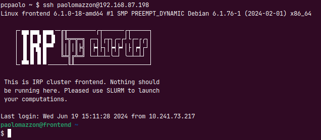

.. _ssh_access:

=============
An SSH primer
=============

The **S**\ecure **SH**\ell protocol is a way to connect to a remote 
machine using an encrypted connection. It is a "text only" protocol
but it can be used to "tunnel" other kind of connections too.

It is natively supported by the main operative systems (e.g. Windows,
Mac OS and Linux), meaning that you can open a terminal emulator on 
each one of them and simply type::

  ssh ...something...

SSH commands (ssh, scp, ...) can do a lot of things and they have a
lot of options to accomodate very complex network configurations, but
in their simplest form they're not so complicated to understand once
you have learned to identify the various "moving parts".

We will introduce 2 different concepts that will greatly simplify
the access to the IRP cluster: `public key authentication <pubkey>`_
and the `ssh config file <sshconfig>`_.

.. _pubkey:

*************************
Public key authentication
*************************

When you are connecting to a remote machine through ssh you are
normally prompted to insert a password. This is not the only way to 
authenticate your user though. Besides: it might get boring after a 
while and it's not very `"automation friendly"` either. You can 
(if the remote machine has been configured appropriately) use the
so called `"public key infrastructure"` to identify yourself using 
a file (your **private key**), as long as your **public key**
(another file `cryptographically coupled` with the private
counterpart) has been installed on the remote machine.

The whole mechanism is exploited in 3 steps:

  #. create a ``[private key, public key]`` pair
  #. install the (public) key on the remote machine
  #. verify you can connect without a password

Generate a key pair
===================

You can create different (based on the cryptographical mechanism) kind
of keys. We will use the more "robust" Ed25519 algorithm for our example.
Open a terminal and type::

  ssh-keygen -t ed25519 -a 150 -f id_mykey

This command creates **two** files called ``id_mykey`` and ``id_mykey.pub`` 
in the current directory using the Ed25519 crypto algorithm.

.. warning::

   During the creation of your keys you will be prompted
   for a `passphrase`: this is a password to protect your key
   in the event it's stolen. 
   
   **DO NOT** skip this passage, please!

   **DO NOT** forget your passphrase ;-)

The two files `lives` normally inside the ``.ssh`` directory in your user's
`home folder`. For the user `paolo` this would be:

  * On Linux ``/home/paolo/.ssh``
  * On Mac OS ``/Users/paolo/.ssh``
  * ON Windows ``C:\Users\paolo\.ssh``
 
If the above directory doesn't exist it's time to create it!

Once you create the directory **move** the two files inside there.

.. note::

   There are some aspects that you better not underestimate when it
   comes to the security of the above directory and especially your
   **private** key. If a user - that is not you - can have access to your
   private key, either because you didn't restrict access to the 
   ``.ssh`` directory or becuse you left a copy of your private key 
   somewhere, that user can have access to your same resources and
   basically **be you** somewhere. This is why you also provide a 
   password to protect your key in case it's stolen: your key is
   useless if it can't be unlocked with the right passphrase.

Copy the (public) key on the remote machine
===========================================

You have been provided a username (e.g. paolomazzon) and password to 
access the remote machine (e.g. 192.168.87.198). Now you want to be 
able to use your key to authenticate. Type:

.. code:: console

   ssh-copy-id paolomazzon@192.168.87.198:

The remote system should answer with something like:

.. code:: console

   /usr/bin/ssh-copy-id: INFO: attempting to log in with the new key(s), to filter out any that are already installed
   /usr/bin/ssh-copy-id: INFO: 1 key(s) remain to be installed -- if you are prompted now it is to install the new keys
   paolomazzon@192.168.87.198's password:

Insert your user's password (hopefully for the last time ;-) ):

.. code:: console

   Number of key(s) added: 1

   Now try logging into the machine, with:   "ssh 'paolomazzon@192.168.87.198'"
   and check to make sure that only the key(s) you wanted were added.

Verify you can connect without a password
=========================================

Notice one of the last messages you received was:

.. code:: console

   Now try logging into the machine, with:   "ssh 'paolomazzon@192.168.87.198'"

so let's try it! ::

   ssh paolomazzon@192.168.87.198

.. note::

   single quotes in the above command are not mandatory!

If everything goes well you should get access to the remote system 
without providing any password:

.. note::

   For the curiously inclined of you: you can try the above command with
   ``ssh -v`` and convince yourself that you are actually using the 
   public key. Find below an excerpt of the message exchange between 
   your and the remote PC:

   .. code:: console

      pcpaolo ~ $ ssh -v paolomazzon@192.168.87.198
      OpenSSH_8.9p1 Ubuntu-3ubuntu0.7, OpenSSL 3.0.2 15 Mar 2022
      ...
      debug1: Connecting to 192.168.87.198 [192.168.87.198] port 22.
      debug1: Connection established.
      debug1: identity file /home/paolo/.ssh/id_ed25519 type 3
      ...
      debug1: Authenticating to 192.168.87.198:22 as 'paolomazzon'
      ...
      debug1: Will attempt key: /home/paolo/.ssh/id_ed25519 ED25519 SHA256:Ac5bL7LAIzQCVrQGGrRN2M3i36hT6jP0nlEksN9w7+0 explicit agent
      ...
      debug1: Authentications that can continue: publickey,password
      debug1: Next authentication method: publickey
      debug1: Offering public key: /home/paolo/.ssh/id_ed25519 ED25519 SHA256:Ac5bL7LAIzQCVrQGGrRN2M3i36hT6jP0nlEksN9w7+0 explicit agent
      debug1: Server accepts key: /home/paolo/.ssh/id_ed25519 ED25519 SHA256:Ac5bL7LAIzQCVrQGGrRN2M3i36hT6jP0nlEksN9w7+0 explicit agent
      Authenticated to 192.168.87.198 ([192.168.87.198]:22) using "publickey".
      ...
      ...
      Linux frontend 6.1.0-18-amd64 #1 SMP PREEMPT_DYNAMIC Debian 6.1.76-1 (2024-02-01) x86_64
      ...
      ...

.. _sshconfig:

*******************
The SSH config file
*******************

Picture this (real example!): 

   * you want to connect to host ``A`` that is on a private network
   * to reach ``A`` you need to "go through" host ``B`` (e.g. ``ssh B``)
   * your username on ``A`` is ``user_A``, identified by the private key ``key_A``
   * your username on ``B`` is ``user_B``, identified by the private key ``key_B``

You also might add to the above that you need to refer to ``A`` or ``B`` by IP
addresses that you need to remember, and that you want to store some 
private keys on a
::

    /very
         /very
              /long
                   /directory_name
                                  /hidden_somewhere

Now read the ssh documentation and try to figure out the exact command...
all on one line :-)

Well, let me introduce you to `the most underrated configuration file ever`:
your ssh personal ``config`` file. To convince you on the truth of what I'm saying
let's just turn the quite convoluted command above into this::

   ssh puppy

Create your initial config
==========================

For the user `paolo`, on the main 3 operative systems the personal config file is::

   * Linux: /home/paolo/.ssh/config
   * Mac OS: /Users/paolo/.ssh/config
   * Windows: C:\Users\paolo\.ssh\config

so let's start by creating the file with your favourite text editor.

.. warning::

   **NO EXTENSIONS PLEASE!!** Under Linux and Mac OS you just create a file
   named ``config`` and you're done, but on Windows it might happen that the
   editor adds the ``.txt`` extension to ``config``. Please rename the file
   and take out the extension in case it happens!

Configure a single host
=======================

We start by configuring the host B. This will simplify the syntax to connect
to **any** single host you might need. 
Remember: we need to go through host B using ``user_B`` as username and providing
``key_B`` for the authentication. Let's say that host B has (the fictional) IP 
address ``8.8.8.100``. Add to your config file the following::

   Host B
   HostName 8.8.8.100
   User user_B
   Identityfile /very/very/long/directory_name/hidden_somewhere/key_B

Save the file and test it: if you previously copied your public key on
the remote host you just need to type::

   ssh B

and you should connect to the remote host.

.. note::

   **PRO TIP:** you can call the host whatever you want, as long as
   you remember what you have called it. This means you can have your
   mini DNS (Domain Name Server) managed by you!

Configure the final host
========================

Let's say you now want to configure host A (IP address: ``192.168.1.5``)
to be able to connect it using ``user_A`` for the username, ``key_A`` for the
private key and host B as the `intermediate host` (a.k.a. ``JumpHost``
on the ssh manual page).
Add, just below the definition above, the lines::

   Host puppy
   HostName 192.168.1.5
   User user_A
   IdentityFile ~/.ssh/key_A
   ProxyCommand ssh B -W %h:%p

Save the file and test it by typing on your terminal
::

   ssh puppy

You might be asked for the private key's passwords (more on that later) but
this should take you on the remote host!

.. note::

   By the way, if you feel the need to type stuff, instead of ``ssh puppy`` 
   you can always use the whole command:

   ``ssh -i ~/.ssh/key_A -o ProxyCommand="ssh -i /very/very/long/directory_name/hidden_somewhere/key_B user_B@8.8.8.100 -W %h:%p" user_A@192.168.1.5``

   **All in one single line, remember!**

`Underrated`. I told you.
